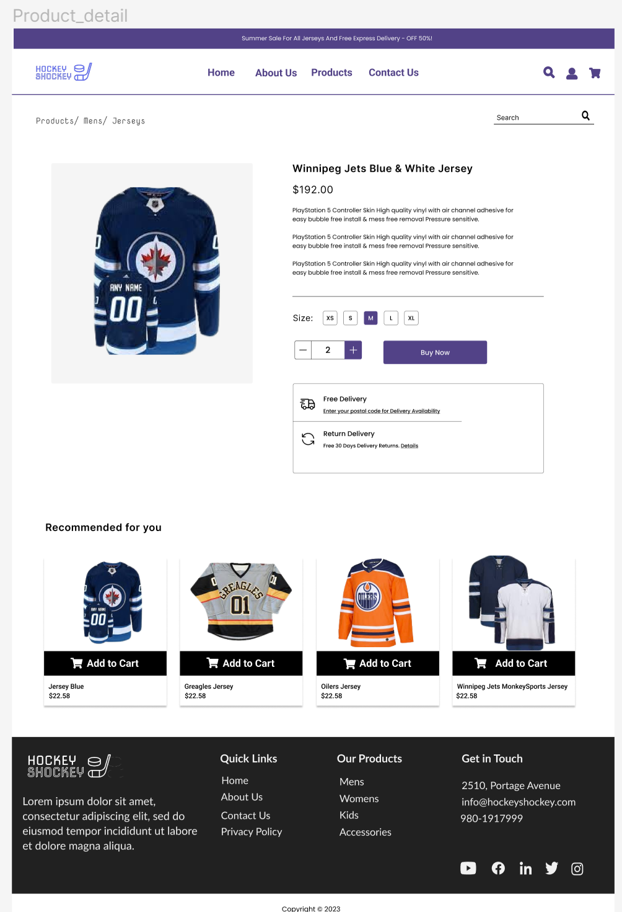
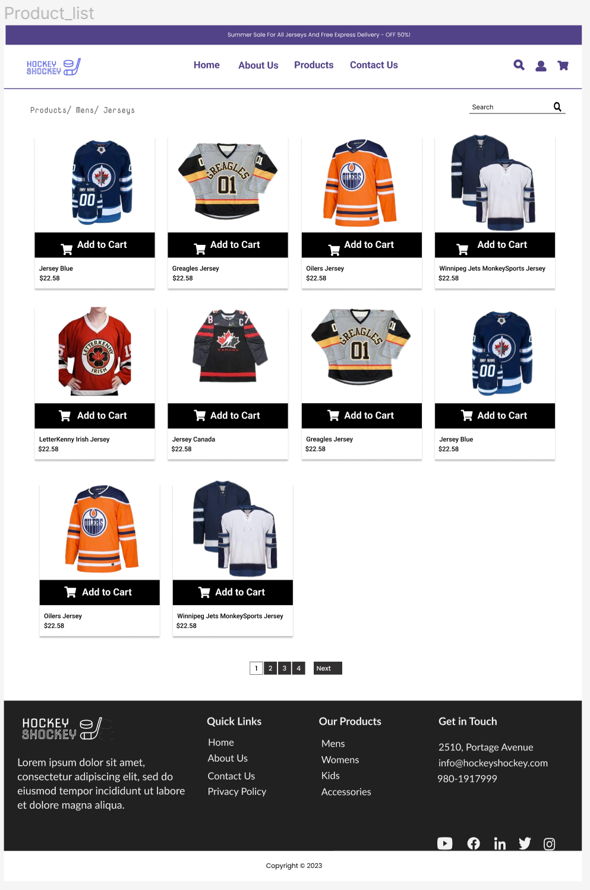
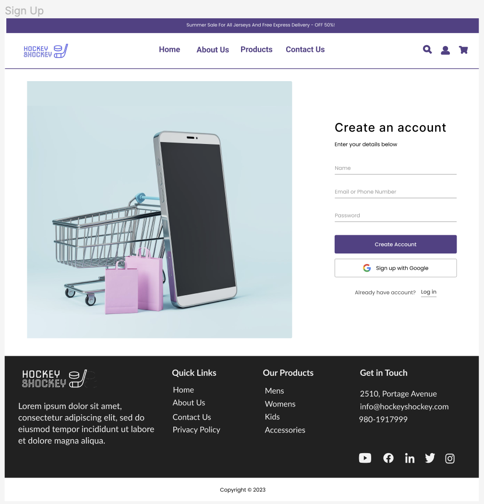
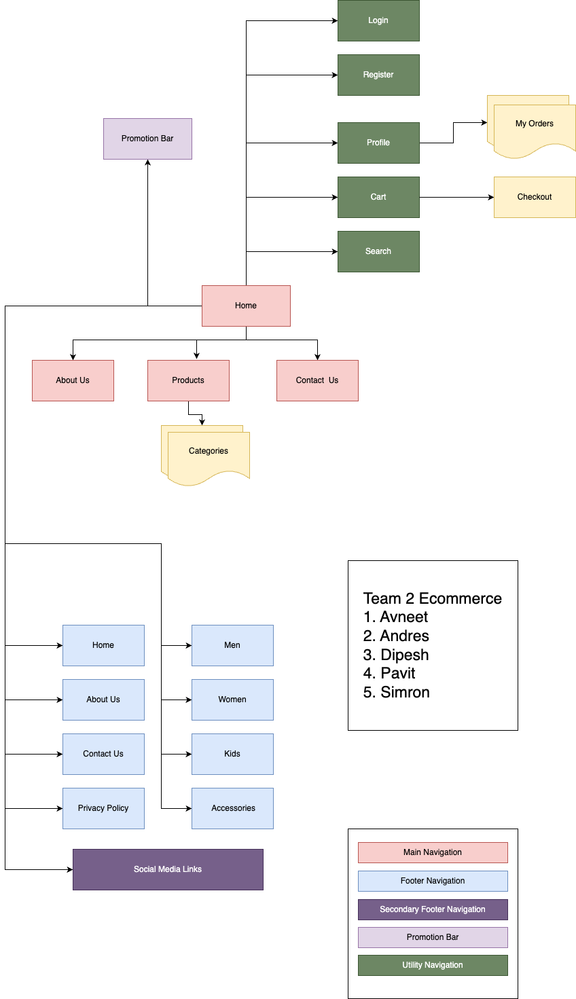
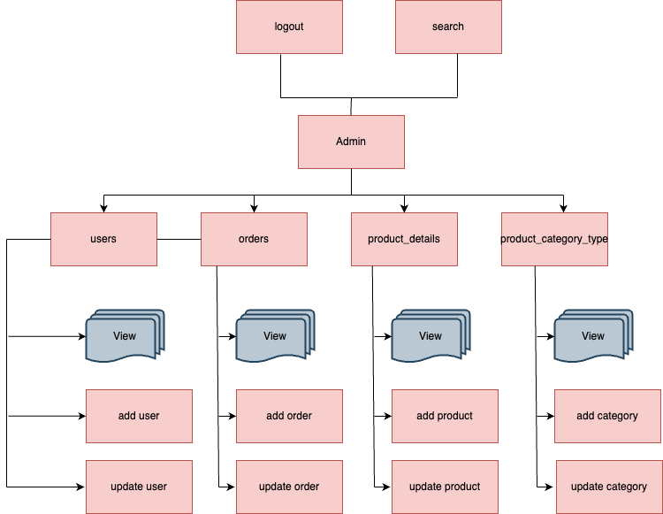

# PROPOSAL

# HOCKEY SHOCKEY:

From: HS Pvt. Ltd.
To: Steve George
Date: December 04, 2023

## 1. Description

Hockey Shockey is excited to invite proposals for the development of a
state-of-the-art e-commerce website dedicated to selling premium
hockey clothings and accessories. The goal of this project is to
create a user-friendly online platform that caters to the needs of
hockey enthusiasts, providing them with a seamless shopping experience
for a wide range of high-quality hockey clothings and accessories.
The project is to develop HockeyShockey, your premier destination for all things hockey! Step into the thrilling world of the fastest sport on ice with our one-stop ecommerce platform. HockeyShockey is more than just a store; it's an immersive experience designed for passionate hockey enthusiasts. Whether you're a seasoned player or a die-hard fan, we bring you a curated collection of high-quality jerseys, and accessories that embody the spirit of the game.

## 2. Target audiences

The target audience for the Hockey Shockey e-commerce website project
consists of:

1. Primary Audience: Hockey Players

Description: Encompasses hockey players at all proficiency levels, from beginners to seasoned professionals. Additionally, it includes hockey enthusiasts who may not actively play but have a passionate interest in the sport.

Significance: This group forms the core user base and will heavily influence the product offerings, user interface, and overall user experience.

2. Secondary Audience: Parents and Guardians

Description: Consists of parents and guardians actively involved in acquiring hockey gear for their children participating in the sport. Coaches and instructors looking for reliable sources of equipment for training and team development.

Significance: Design decisions should address the needs of parents seeking youth gear and coaches seeking quality equipment for training purposes.

3. Tertiary Audience: Gift shoppers

Description: Gift shoppers looking for hockey-related gifts for friends, family members, or colleagues who are hockey enthusiasts or players.

Significance: Design considerations should include features that make the shopping experience easy and appealing for gift buyers.

## 3. Project Details

**Project Overview:**
Hockey Shockey is embarking on an exciting venture to launch a
cutting-edge e-commerce website dedicated to meeting the needs of
hockey players and enthusiasts. The project aims to create a dynamic
online platform that seamlessly integrates a variety of features and
functionalities to enhance the user experience.

**Key Features and Functionality:**

1. User-Friendly Interface:

Intuitive and visually appealing design for effortless navigation.
Clear and concise layout to highlight featured products and
promotions.

2. Secure E-commerce Functionality:

Integration with secure payment gateways for safe and reliable online
transactions. SSL encryption to ensure the protection of customer data
during the checkout process.

3. Responsive Design:

A responsive website design to provide an optimal viewing and shopping
experience across various devices, including desktops, tablets, and
smartphones.

4. Product Catalog:

Comprehensive catalog featuring a wide range of hockey accessories,
including sticks, skates, protective gear, apparel, and training
equipment. Easy-to-use filters for sorting products based on brand,
price, and popularity.

5. Search and Navigation:

Advanced search functionality with filters to help users quickly find
specific products. Intuitive navigation with clear categories and
subcategories.

6. Personalized User Accounts:

User account creation for a personalized shopping experience. Saved
preferences, order history, and wishlist features.

7. Social Media Integration:

Seamless integration with popular social media platforms for easy
sharing of products and promotions.

8. Shipping and Order Tracking:

Multiple shipping options for customer flexibility. Order tracking
functionality to keep customers informed about the status of their
purchases.

## 4. Proposed Design Solution

The proposed design solution aims to blend aesthetics with
functionality, creating a compelling and efficient e-commerce platform
for hockey enthusiasts. Through a visually dynamic interface,
user-centric features, and robust security measures, the Hockey
Shockey website will not only showcase premium hockey accessories but
also provide an immersive and enjoyable shopping experience for our
diverse audience.

;

;

;

## 5. User Personas/Use Case statements

1. Guest Shopper - Sarah, the Hockey Parent

**Demographic:**

- Age: 35
- Occupation: Marketing Professional
- Relationship to Hockey: Parent of a youth hockey player
  **Use Case Statement:**
- Objective: Sarah wants to explore and purchase hockey gear for her
  child who recently joined a youth hockey league.
- Interaction: Visits the site, browses youth hockey equipment, reads
  reviews, and makes a purchase securely as a guest.

2. Authenticated Shopper - Alex, the Competitive Player

**Demographic:**

- Age: 25
- Occupation: Software Developer
- Relationship to Hockey: Active competitive hockey player

**Use Case Statement:**

- Objective: Alex is looking for specific advanced-level hockey gear
  for his competitive matches.
- Interaction: Logs into his account, reviews past purchases, adds
  items to his wishlist, and completes a secure checkout with his saved
  payment details.

3. Customer Service Representative (CSR) - Jordan

**Demographic:**

- Age: 28
- Occupation: Customer Service Representative
- Relationship to Hockey: Limited knowledge about hockey equipment

  **Use Case Statement:**

- Objective: Jordan assists customers with inquiries, order tracking,
  and product information.
- Interaction: Accesses the CSR dashboard, responds to customer
  queries via live chat or email, and helps troubleshoot any issues
  related to orders or products.

4. Admin - Mackenzie, the E-commerce Manager

**Demographic:**

- Age: 30
- Occupation: E-commerce Manager
- Relationship to Hockey: Passionate about the sport, responsible for
  the online store's performance
  **Use Case Statement:**
- Objective: Mackenzie oversees the website's performance, manages
  inventory, and monitors sales analytics.
- Interaction: Accesses the admin dashboard, updates product listings,
  reviews sales reports, and manages promotions to optimize the site's
  performance.

These user personas and use case statements are crafted to represent a
diverse range of potential users for the Hockey Shockey e-commerce
website. Understanding the needs and behaviors of these users helps in
tailoring the front-end user experience to ensure that the site is
user-friendly, engaging, and capable of meeting the unique
requirements of each user type.

## 6. Sitemaps

**Front end**

;

**Back end**

;

## 7. Server

**Front-End:**

HTML
CSS
JavaScript

**Back-End:**

PHP version 8.1.2-1ubuntu2.14 (cli)
Built on Aug 18, 2023
PHP Copyright: The PHP Group
Zend Engine version 4.1.2
Zend Engine Copyright: Zend Technologies
Zend OPcache version 8.1.2-1ubuntu2.14
OPcache Copyright: Zend Technologies

**Database:**

MySQL version 8.0.35-0ubuntu0.22.04.1 for Linux on x86_64 ((Ubuntu))

**Server:**

Apache Server

**Cloud Hosting:**

Amazon AWS EC2

**Authentication:**

JSON Web Tokens (JWT) for user authentication

**Additional Tools:**

Composer version 2.6.5 (as of Oct 6, 2023)

## 8. Database

The database for the Hockey Shockey e-commerce website is designed to
efficiently store and manage data related to products, users, orders,
and other essential entities. The database structure follows
normalization principles to ensure data integrity, minimize
redundancy, and support scalability.

**Primary Entities:**

1. users:

**Attributes:**

    							- user_id INT (Primary Key)
    							- first_name VARCHAR (45)
    							- last_name VARCHAR (45)
    							- gender VARCHAR (45)
    							- date_of_birth DATE
    							- email VARCHAR (45)
    							- contact_no VARCHAR(45)
    							- user_name VARCHAR (45)
    							- password VARCHAR (45)
    							- address_line_1 VARCHAR (45)
    							- address_line_2 VARCHAR (45)
    							- city VARCHAR (45)
    							- country VARCHAR (45)

2. orders:

**Attributes:**

    							- order_id INT
    							- user_id INT
    							- total DECIMAL (20,0)
    							- up_id INT - status VARCHAR (45)
    								- status VARCHAR (45)
    							- created_at TIMESTAMP
    							- updated_at TIMESTAMP
    							- modified_at TIMESTAMP
    							- orderscol VARCHAR (45)

3. product_details:

**Attributes:**

    								-	product_id INT
    								-	product_name VARCHAR(45)
    								-	product_description VARCHAR(45)
    								-	product_image VARCHAR(45)
    								-	product_size VARCHAR(45)
    								-	price VARCHAR(45)
    								-	availability_status VARCHAR(45)
    								-	pct_id INT
    								-	d_id VARCHAR(45)
    								-	inventory_id INT
    								-	created_at TIMESTAMP
    								-	modified_at TIMESTAMP
    								-	deleted_at TIMESTAMP

4. payment_detail:

**Attributes:**

                    - payment_id INT
                    - user_id INT
                    - payment_type VARCHAR(45)
                    - provider VARCHAR(45)
                    - account_no BIGINT
                    - expiry DATE

5. product_inventory:

**Attributes:**

                    - pi_id INT
                    - quantity INT
                    - created_at TIMESTAMP
                    - modified_at TIMESTAMP
                    - deleted_at TIMESTAMP

6. product_category_type:

**Attributes:**

                    - pct_id INT
                    - pct_name VARCHAR(45)
                    - created_at TIMESTAMP
                    - modified_at TIMESTAMP
                    - deleted_at TIMESTAMP

6. cart_item:

**Attributes:**

                    - ci_id INT
                    - product_id INT
                    - quantity INT
                    - created_at TIMESTAMP
                    - modified_at TIMESTAMP
                    - deleted_at TIMESTAMP

By following normalization principles, the database for the Hockey
Shockey e-commerce website is designed to provide a solid foundation
for data integrity, scalability, and efficient data retrieval. The
balance between normalization and judicious denormalization is
maintained to meet the specific requirements of the e-commerce
platform.

## 9. Value adds

Adding value to the Hockey Shockey e-commerce website involves
incorporating features and functionalities that go beyond the basic
e-commerce and administrative capabilities. These enhancements are
designed to provide a richer and more engaging experience for users,
contributing to customer satisfaction and business success. Here are
some value-added features that can be considered within the specified

Wishlist Entity:

Each wishlist is represented as an entity with a unique identifier (wishlist_id).
It is associated with a specific user through a foreign key (user_id).
The wishlist contains references to the products added by the user (product_id).
Timestamp (added_at) indicates when a product was added to the wishlist.
User-Wishlist Relationship:

Each user can have multiple wishlists, allowing for organization based on preferences or categories.
The relationship between users and wishlists is established through the user's unique identifier.
Product-Wishlist Relationship:

Each product can be part of multiple wishlists across different users.
The relationship between products and wishlists is established through the product's unique identifier.

## 10. Revised ERD for Value Adds

Wishlist Feature:
Entity: Wishlist

Attributes:
wishlist_id (Primary Key)
user_id (Foreign Key referencing Users)
product_id (Foreign Key referencing Products)
added_at (Timestamp)
Relationships:

Each user can have multiple items in their wishlist (User to Wishlist - One-to-Many).
Each product can be added to multiple wishlists (Product to Wishlist - One-to-Many).
This simplified ERD focuses specifically on the Wishlist feature, allowing users to save products they are interested in for future reference. The relationships ensure that each user has their own wishlist, and each product can be part of multiple wishlists across different users.

## 11. Our Team

Pavit Singh Makkar - Project Manager:

Role: As the Project Manager, Pavit oversees the entire project lifecycle. His responsibilities include project planning, coordination, and ensuring that the team is aligned with the project goals. Pavit plays a crucial role in resource management, timelines, and communication within the team.

**Andres - Full Stack Developer:**

Role: Andres is our Full Stack Developer responsible for both front-end and back-end development. He works on creating a seamless and interactive user experience, handling everything from user interfaces to server-side logic. Andres contributes to the technical architecture and ensures the website's functionality aligns with the project's objectives.
**Avneet - Database Administrator:**

Role: Avneet specializes in database management and optimization. As the Database Administrator, Avneet designs and maintains the database architecture, ensuring data integrity, scalability, and efficient retrieval. Avneet is crucial for the secure and organized storage of user and product-related information.
**Simron Shrestha - Design:**

Role: Simron is our talented designer, responsible for creating the visual identity of the Hockey Shockey e-commerce website. Simron's role involves crafting visually appealing user interfaces, ensuring a seamless and engaging user experience. Simron's designs align with the brand image and enhance the overall aesthetics of the platform.
**Dipesh Ram Shrestha - HTML, CSS, JavaScript:**

Role: Dipesh specializes in front-end development, working with HTML, CSS, and JavaScript. His role involves translating design concepts into functional and responsive web pages. Dipesh ensures that the website's front-end is not only visually appealing but also optimized for performance and usability.
