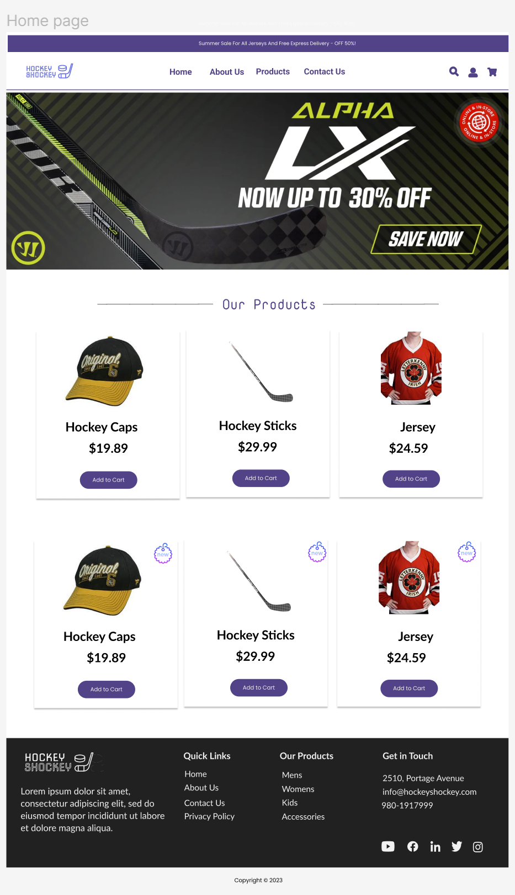

# PROPOSAL

# HOCKEY SHOCKEY:

From: HS Pvt. Ltd.
To: Steve George
Date: December 04, 2023

## 1. Description

Hockey Shockey is excited to invite proposals for the development of a
state-of-the-art e-commerce website dedicated to selling premium
hockey clothings and accessories. The goal of this project is to
create a user-friendly online platform that caters to the needs of
hockey enthusiasts, providing them with a seamless shopping experience
for a wide range of high-quality hockey clothings and accessories.
The project is to develop HockeyShockey, your premier destination for all things hockey! Step into the thrilling world of the fastest sport on ice with our one-stop ecommerce platform. HockeyShockey is more than just a store; it's an immersive experience designed for passionate hockey enthusiasts. Whether you're a seasoned player or a die-hard fan, we bring you a curated collection of high-quality jerseys, and accessories that embody the spirit of the game.

## 2. Target audiences

The target audience for the Hockey Shockey e-commerce website project
consists of:

1. Primary Audience:

The primary audience encompasses hockey players at all proficiency
levels, ranging from beginners sharpening their skills to seasoned
professionals engaged in the sport. Additionally, the platform targets
hockey enthusiasts—individuals with a fervent passion for the game,
whether or not they actively participate. This inclusive category
spans across dedicated fans, supportive parents, and ardent backers of
various hockey teams.

2. Secondary Audience:

The website aims to attract parents and guardians who play a pivotal
role in acquiring hockey gear and accessories for their children
actively involved in the sport. Furthermore, coaches and instructors
form an essential segment of the secondary audience, as they seek
reliable sources for procuring equipment essential for training and
nurturing their teams or individual athletes.

3. Tertiary Audience:

Our tertiary audiences are the Gift Shoppers, who are looking for
gifts for friends, family members, or colleagues who are hockey
enthusiasts or players.

**Influence on Design Choices:**

1. User Interface (UI) Design:

The design should be visually appealing, capturing the excitement and
energy associated with the sport of hockey. Easy navigation and a
clean layout are crucial to cater to users with varying levels of
technological proficiency, including both players and non-players.

2. Product Catalog:

The catalog should be well-organized with clear categories, making it
easy for players and enthusiasts to find specific gear or browse for
inspiration. High-quality images and detailed product descriptions are
essential to help customers make informed purchase decisions.

3. Responsive Design:

Given the diverse target audience, a responsive design is imperative
to ensure a seamless shopping experience across various devices,
including mobile phones and tablets.

4. Personalized User Accounts:

The option for user accounts caters to players who may want to track
their purchase history and preferences. It also facilitates a smoother
shopping experience for returning customers.

5. Social Media Integration:

The integration of social media features aligns with the social nature
of sports, allowing users to share their purchases, experiences, and
recommendations with their networks.

## 3. Project Details

**Project Overview:**
Hockey Shockey is embarking on an exciting venture to launch a
cutting-edge e-commerce website dedicated to meeting the needs of
hockey players and enthusiasts. The project aims to create a dynamic
online platform that seamlessly integrates a variety of features and
functionalities to enhance the user experience.

**Key Features and Functionality:**

1. User-Friendly Interface:

Intuitive and visually appealing design for effortless navigation.
Clear and concise layout to highlight featured products and
promotions.

2. Secure E-commerce Functionality:

Integration with secure payment gateways for safe and reliable online
transactions. SSL encryption to ensure the protection of customer data
during the checkout process.

3. Responsive Design:

A responsive website design to provide an optimal viewing and shopping
experience across various devices, including desktops, tablets, and
smartphones.

4. Product Catalog:

Comprehensive catalog featuring a wide range of hockey accessories,
including sticks, skates, protective gear, apparel, and training
equipment. Easy-to-use filters for sorting products based on brand,
price, and popularity.

5. Search and Navigation:

Advanced search functionality with filters to help users quickly find
specific products. Intuitive navigation with clear categories and
subcategories.

6. Personalized User Accounts:

User account creation for a personalized shopping experience. Saved
preferences, order history, and wishlist features.

7. Social Media Integration:

Seamless integration with popular social media platforms for easy
sharing of products and promotions. Social login options for user
convenience.

8. Shipping and Order Tracking:

Multiple shipping options for customer flexibility. Order tracking
functionality to keep customers informed about the status of their
purchases.

## 4. Proposed Design Solution

The proposed design solution aims to blend aesthetics with
functionality, creating a compelling and efficient e-commerce platform
for hockey enthusiasts. Through a visually dynamic interface,
user-centric features, and robust security measures, the Hockey
Shockey website will not only showcase premium hockey accessories but
also provide an immersive and enjoyable shopping experience for our
diverse audience.

;

;

;

## 5. User Personas/Use Case statements

1. Guest Shopper - Sarah, the Hockey Parent

**Demographic:**

- Age: 35
- Occupation: Marketing Professional
- Relationship to Hockey: Parent of a youth hockey player
  **Use Case Statement:**
- Objective: Sarah wants to explore and purchase hockey gear for her
  child who recently joined a youth hockey league.
- Interaction: Visits the site, browses youth hockey equipment, reads
  reviews, and makes a purchase securely as a guest.

2. Authenticated Shopper - Alex, the Competitive Player

**Demographic:**

- Age: 25
- Occupation: Software Developer
- Relationship to Hockey: Active competitive hockey player
  **Use Case Statement:**
- Objective: Alex is looking for specific advanced-level hockey gear
  for his competitive matches.
- Interaction: Logs into his account, reviews past purchases, adds
  items to his wishlist, and completes a secure checkout with his saved
  payment details.

3. Customer Service Representative (CSR) - Jordan

**Demographic:**

- Age: 28
- Occupation: Customer Service Representative
- Relationship to Hockey: Limited knowledge about hockey equipment
  **Use Case Statement:**
- Objective: Jordan assists customers with inquiries, order tracking,
  and product information.
- Interaction: Accesses the CSR dashboard, responds to customer
  queries via live chat or email, and helps troubleshoot any issues
  related to orders or products.

4. Admin - Mackenzie, the E-commerce Manager

**Demographic:**

- Age: 30
- Occupation: E-commerce Manager
- Relationship to Hockey: Passionate about the sport, responsible for
  the online store's performance
  **Use Case Statement:**
- Objective: Mackenzie oversees the website's performance, manages
  inventory, and monitors sales analytics.
- Interaction: Accesses the admin dashboard, updates product listings,
  reviews sales reports, and manages promotions to optimize the site's
  performance.

These user personas and use case statements are crafted to represent a
diverse range of potential users for the Hockey Shockey e-commerce
website. Understanding the needs and behaviors of these users helps in
tailoring the front-end user experience to ensure that the site is
user-friendly, engaging, and capable of meeting the unique
requirements of each user type.

## 6. Sitemaps

**Front end**

;

**Back end**

;

## 7. Server

**Front-End:**

HTML
CSS
JavaScript

**Back-End:**

PHP version 8.1.2-1ubuntu2.14 (cli)
Built on Aug 18, 2023
PHP Copyright: The PHP Group
Zend Engine version 4.1.2
Zend Engine Copyright: Zend Technologies
Zend OPcache version 8.1.2-1ubuntu2.14
OPcache Copyright: Zend Technologies

**Database:**

MySQL version 8.0.35-0ubuntu0.22.04.1 for Linux on x86_64 ((Ubuntu))

**Server:**

Apache Server

**Cloud Hosting:**

Amazon AWS EC2

**Authentication:**

JSON Web Tokens (JWT) for user authentication

**Additional Tools:**

Composer version 2.6.5 (as of Oct 6, 2023)

## 8. Database

The database for the Hockey Shockey e-commerce website is designed to
efficiently store and manage data related to products, users, orders,
and other essential entities. The database structure follows
normalization principles to ensure data integrity, minimize
redundancy, and support scalability.

**Primary Entities:**

1. users:

**Attributes:**

    							- user_id INT (Primary Key)
    							- first_name VARCHAR (45)
    							- last_name VARCHAR (45)
    							- gender VARCHAR (45)
    							- date_of_birth DATE
    							- email VARCHAR (45)
    							- contact_no VARCHAR(45)
    							- user_name VARCHAR (45)
    							- password VARCHAR (45)
    							- address_line_1 VARCHAR (45)
    							- address_line_2 VARCHAR (45)
    							- city VARCHAR (45)
    							- country VARCHAR (45)

2. orders:

**Attributes:**

    							- order_id INT
    							- user_id INT
    							- total DECIMAL (20,0)
    							- up_id INT - status VARCHAR (45)
    								- status VARCHAR (45)
    							- created_at TIMESTAMP
    							- updated_at TIMESTAMP
    							- modified_at TIMESTAMP
    							- orderscol VARCHAR (45)

3. product_details:

**Attributes:**

    								-	product_id INT
    								-	product_name VARCHAR(45)
    								-	product_description VARCHAR(45)
    								-	product_image VARCHAR(45)
    								-	product_size VARCHAR(45)
    								-	price VARCHAR(45)
    								-	availability_status VARCHAR(45)
    								-	pct_id INT
    								-	d_id VARCHAR(45)
    								-	inventory_id INT
    								-	created_at TIMESTAMP
    								-	modified_at TIMESTAMP
    								-	deleted_at TIMESTAMP

4. payment_detail:

**Attributes:**

                    - payment_id INT
                    - user_id INT
                    - payment_type VARCHAR(45)
                    - provider VARCHAR(45)
                    - account_no BIGINT
                    - expiry DATE

5. product_inventory:

**Attributes:**

                    - pi_id INT
                    - quantity INT
                    - created_at TIMESTAMP
                    - modified_at TIMESTAMP
                    - deleted_at TIMESTAMP

6. product_category_type:

**Attributes:**

                    - pct_id INT
                    - pct_name VARCHAR(45)
                    - created_at TIMESTAMP
                    - modified_at TIMESTAMP
                    - deleted_at TIMESTAMP

6. cart_item:

**Attributes:**

                    - ci_id INT
                    - product_id INT
                    - quantity INT
                    - created_at TIMESTAMP
                    - modified_at TIMESTAMP
                    - deleted_at TIMESTAMP

**Normalization/Denormalization Considerations:**

- Normalization Choice:

      - The database leans towards normalization to maintain data

  integrity, reduce redundancy, and facilitate efficient updates. - Normalized structures support scalability and make it easier to
  manage and update data without inconsistencies.

**Denormalization for Performance:**

- Some degree of denormalization may be considered for performance
  optimization in certain scenarios, such as generating complex reports
  or improving query speed.
- Materialized views or caching mechanisms can be implemented for
  specific use cases without compromising the overall normalized
  structure.

**Balancing Read and Write Operations:**

- The design aims for a balance between read and write operations,
  ensuring that common queries for product information, user details,
  and order history are efficient, while still allowing for
  straightforward updates and inserts.

By following normalization principles, the database for the Hockey
Shockey e-commerce website is designed to provide a solid foundation
for data integrity, scalability, and efficient data retrieval. The
balance between normalization and judicious denormalization is
maintained to meet the specific requirements of the e-commerce
platform.

## 9. Value adds

Adding value to the Hockey Shockey e-commerce website involves
incorporating features and functionalities that go beyond the basic
e-commerce and administrative capabilities. These enhancements are
designed to provide a richer and more engaging experience for users,
contributing to customer satisfaction and business success. Here are
some value-added features that can be considered within the specified
budget:

1. Personalized Recommendations:

Implement an intelligent recommendation engine that analyzes user
behavior and purchase history to provide personalized product
suggestions. This enhances the shopping experience and encourages
additional purchases.

2. Virtual Try-On for Gear:

Integrate a virtual try-on feature that allows users to visualize how
hockey gear (e.g., helmets, jerseys) looks on them using augmented
reality (AR) technology. This helps customers make more informed
purchase decisions.

3. Interactive Product Demos:

Include interactive 3D or video demonstrations for key products,
providing customers with a closer look at the features and
functionality of high-end hockey equipment.

4. Gamified Loyalty Program:

Develop a gamified loyalty program where customers earn points,
badges, or rewards for making purchases, leaving reviews, and engaging
with the site. This encourages repeat business and customer
engagement.

5. Live Chat Support:

Integrate a live chat support system to enable real-time communication
between customers and customer service representatives. This feature
enhances customer support and provides quick assistance during the
shopping process.

6. In-Depth Product Guides:

Create comprehensive product guides, including video tutorials and
in-depth articles, to educate customers about choosing the right
hockey gear based on their skill level, playing style, and
preferences.

7. Social Media Integration for User-Generated Content:

Enhance social media integration by allowing users to share their
purchases, reviews, and experiences directly from the website.
User-generated content can be showcased to build a sense of community
around the brand.

8. Customization Options:

Enable users to customize certain products, such as jerseys or
equipment, with personalized colors, names, or logos. This feature
adds a layer of personalization to the shopping experience.

9. Augmented Reality (AR) Fitting Room:

Integrate AR technology to create a virtual fitting room where users
can virtually try on products like hockey jerseys or apparel before
making a purchase, enhancing the online shopping experience.

10. Dynamic Pricing and Discounts:

Implement dynamic pricing strategies based on user behavior, seasonal
trends, or inventory levels. Introduce smart discounts and promotions
to incentivize purchases and optimize revenue.

11. One-Click Reorder:

Streamline the reordering process by incorporating a one-click reorder
option for users who frequently purchase the same products. This
reduces friction for repeat customers.

12. Real-Time Inventory Alerts:

Provide users with the option to receive real-time alerts or
notifications when their favorite products are back in stock, helping
them stay informed and enabling timely purchases.

These value-added features not only enhance the functionality of the
Hockey Shockey e-commerce website but also contribute to a more
immersive and personalized user experience. The implementation of
these features within the specified budget can elevate the website's
competitiveness and appeal to a broader audience of hockey
enthusiasts.

## 10. Revised ERD for Value Adds

Implementing the value-added features for the Hockey Shockey
e-commerce website involves considering additional entities,
relationships, and attributes in the Entity-Relationship Diagram
(ERD). Here's a brief description of the changes that might be
required:

1. Personalized Recommendations:

- Change: Introduce a new entity for user preferences or recommendations.
- Description: This entity would store data related to user
  preferences, purchase history, and recommended products, establishing
  relationships with the Users and Products entities.

2. Virtual Try-On for Gear:

- Change: Enhance the Products entity with attributes related to
  virtual try-on options.
- Description: Add attributes such as "AR_Model_Link" or
  "Virtual_Try_On_Available" to the Products entity to indicate whether
  a product supports virtual try-on.

3. Interactive Product Demos:

- Change: Introduce a new entity for interactive demonstrations.
- Description: Create an entity that includes details about
  interactive demos, linking to specific products and possibly including
  multimedia resources like videos or 3D models.

4. Gamified Loyalty Program:

- Change: Introduce a Loyalty entity.
- Description: This entity would store information about customer
  loyalty points, badges, and rewards. It establishes relationships with
  the Users entity to associate loyalty data with specific users.

5. Live Chat Support:

- Change: Introduce a new entity for chat interactions.
- Description: Create an entity to log chat interactions, associating
  them with specific users and potentially orders. This ensures a record
  of customer support interactions.

6. In-Depth Product Guides:

- Change: Enhance the Products entity with attributes for guide resources.
- Description: Add attributes like "Product_Guide_Link" to the
  Products entity, allowing links to in-depth guides associated with
  specific products.

7. Social Media Integration for User-Generated Content:

- Change: Consider adding a SocialMedia entity.
- Description: If detailed tracking of user-generated content is
  required, create an entity to store social media-related data,
  connecting it to the Users and Products entities.

8. Customization Options:

- Change: Modify the Products entity to include customization attributes.
- Description: Add attributes like "Customizable_Colors" or
  "Personalization_Options" to denote which products are customizable.

9. Augmented Reality (AR) Fitting Room:

- Change: Enhance the Products entity with AR-related attributes.
- Description: Include attributes such as "AR_Fitting_Room_Link" or
  "AR_Supported" in the Products entity to enable virtual fitting room
  capabilities.

10. Dynamic Pricing and Discounts:

- Change: Consider adding a Pricing entity.
- Description: Create an entity to manage dynamic pricing strategies,
  linking it to the Products entity and possibly introducing attributes
  for discount rules.

11. One-Click Reorder:

- Change: Enhance the Orders entity with attributes for reorder history.
- Description: Add attributes such as "Reorder_History" to the Orders
  entity, facilitating the identification of frequently reordered
  products.

12. Real-Time Inventory Alerts:

- Change: Modify the Products entity to include inventory alert attributes.
- Description: Introduce attributes like "Inventory_Alert_Status" or
  "Alert_Threshold" in the Products entity to enable real-time inventory
  notifications.

These changes will augment the existing ERD to accommodate the
additional features, ensuring that the database structure remains
flexible, scalable, and capable of supporting the enhanced
functionality of the Hockey Shockey e-commerce website.

## 11. Our Team

Pavit Project Management
Andres
Avneet Designing
Simron Shrestha Server
Dipesh Ram Shrestha Documentation
